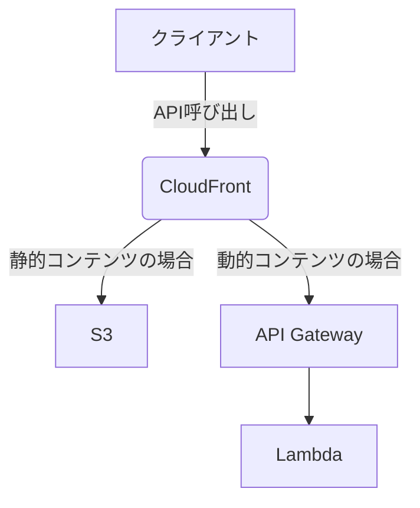

# 書籍
https://honto.jp/netstore/pd-book_29210426.html

# 1章 Webシステム
## 1-1［パターン1］キャンペーンサイト
リージョン選択
- リージョンによってレスポンスとコストが変わる
  - 地理的に近いリージョンのほうがレスポンスは速いが、遠いリージョンのほうが安かったりする。
  - リージョンは一度決めると変更にかなり手間がかかる。目的に合ったリージョン選択をすること。

VPCサブネット
- サブネットの分け方
  - 論理的なネットワークを設計して、AWSでのサブネット実装に紐づけていく。
  - 【例：WebサーバーとDBサーバーの場合】
    2つのサーバーではフィルタリングポリシーが異なるため、サブネットを分ける。
    - Webサーバー：インターネットからのHTTP受信を許可。
    - DBサーバー：Webサーバーからのデータベース接続のみ許可。
  - （サブネットは、単一のAZ内に作成。）

セキュリティグループ設定でのフィルタリング
- EC2インスタンスに設定するセキュリティグループ
  - SSH(TCP, ポート22) : 自社グローバルIPアドレスを指定。
  - HTTP(S) : 0.0.0.0/0（ALL）

固定IPとホスト名でアクセス可能に
- 取得した秘密鍵はSSHクライアントに読み込ませる。（大切に保管。）
- FQDN : 完全修飾ドメイン名 / 絶対ドメイン名。`www.example.co.jp`のようにドメイン名を省略せずにすべて指定した表記のこと。
- 外部からFQDNでアクセスするための設定
  - ElasticIPで固定のグローバルIPアドレスを設定。
  - Route53でDNSを定義。

インターネット接続を可能に
- サブネット→外部にアクセスするためには、下記のようにルートテーブルに登録。
  - パブリックサブネットの場合
    - 送信先: 0.0.0.0/0
    - ターゲット: **インターネットゲートウェイ**
  - プライベートサブネットの場合
    - 送信先: 0.0.0.0/0
    - ターゲット: **NATゲートウェイ**

OS環境をWebサーバーとして使えるように設定
- ec2user : AmazonLinuxで管理者としてデフォルトで登録されているユーザ。

## 1-2［パターン2］コーポレートサイト
ELBでのWebサーバーの冗長化
- セットアップしたインスタンスは、AMIとして登録して、それを元にインスタンスを複製する。（何回もセットアップしなくて済む。）

ELB設定ポイント
- セキュリティグループ設定
  - ELB
    HTTP(S) : 0.0.0.0/0（ALL）
  - EC2インスタンス
    HTTP : 10.0.0.0/24（ELBが属するサブネット）
- セッション
  セッション維持が必要であれば、ELB自身が作成するCookieの情報を素に同じサーバーに振り分ける**スティッキーセッション**を設定する。
- SSLターミネーション
  ELBにSSL証明書を登録しておくことで、暗号/復号処理をELBで行う。
  このことで、クライアント→ELBは`HTTPS`、ELB→Webサーバーは`HTTP`で通信できる。
  - 個々のWebサーバーに証明書を登録する必要がなくなる。
  - SSL復号処理の負担が下がる。（インスタンスのコストが下がる。）

RDSでのDBサーバーの冗長化
- マルチAZ設定
  異なるAZに複数のサブネットを用意。そしてそれらを束ねるサブネットグループを作成し、RDSにアタッチする。
- マスターのDBサーバーに障害が起きた場合、スレーブがマスターに自動で昇格する。
  ただし、WebサーバーとDBサーバーとの接続切り替えは別途必要。

静的コンテンツを低コストに配信する
- S3
  静的コンテンツはS3に置くほうがEC2内よりも安価。
- CloudFront
  - 参照先振り分け機能
    動的コンテンツはELB, 静的コンテンツはS3 といったように振り分けできる。
    ただし、ワイルドカード指定で動的コンテンツと静的コンテンツを区別できる場合でないと難しい。（設定が煩雑）
    （`/javascript/*`, `/image/*`など）

## 1-3［パターン3］性能重視のイントラWeb
アプリサーバーのスケーリング
- AutoScaling
  - AutoScalingには、CloudWatchを組み合わせる。
    - CloudWatchは、インスタンスを監視して、処理能力が不足するとアラートを通知する。
    - AutoScalingは、アラートをトリガーに、新しいアプリケーションサーバーを自動起動。
      - トリガーのメトリクスは色々な項目から選択できるが、軽く調べたところでは`CPU利用率`を設定しているところが多かった。
  - **AutoScalingグループに、ELBをアタッチする**。
    - ELB宛てのリクエストがAutoScalingグループのインスタンスに振り分けられる。
  - **AutoScalingグループに、AMIを登録する**。
    - リリースの度にAMIを更新するのは運用が煩雑になるため、インスタンス起動時にスクリプトを実行する**ユーザデータ**という機能を使うと良い。
      (ユーザデータの処理が多くなって処理が長くなるとスケールアウトのときに時間がかかる。)
  - スケールインした後も使うデータ（ログなど）はEBS領域に格納しておく。

## 1-4［パターン4］可用性重視のイントラWeb
- 可用性について考えるときは、サービスが停止する前提で考える。
- 可用性を高めるにはコストがかかる。求められる可用性に見合った構成にすること。
- マルチリージョン
  - Route53のDNSフェイルオーバー機能を使う。
    - Route53でELBを監視させ、メインリージョンのELB配下のインスタンスとアプリケーションがすべてダウンしたと判断すると、別リージョンに自動的に切り替える。
    - Route53が単一障害点になりそうだが、サービス内部で何重にも可用性を高める工夫がされており、SLA100%のため問題ない。
    - 複数リージョン間で同じサーバーとデータが存在する前提なので、下記いずれかの対応が必要。
      - A: ダウンタイムは短いが、その分高価。
        - EBSのバックアップ : スナップショットのコピーを定期実行する or データ同期ツールを使う（LinuxのDRBDなど）。
        - RDSのクロスリージョンレプリカ機能 : マスタースレーブ（リードレプリカ）。
        - S3のクロスリージョンレプリケーション機能 : データ同期。
      - B: ダウンタイムは長いが、その分安価。
        - AMIのコピー : コピーを保管しておく。
        - EBS, RDSのスナップショット : コピーを保管しておく。
        - S3のクロスリージョンレプリケーション機能

# 2章 ストレージシステム
略。
- 2-1［パターン5］バックアップ
- 2-2［パターン6］ファイルサーバー

# 3章　データ分析システム
略。
- 3-1［パターン7］構造化データの分析
- 3-2［パターン8］非構造化データの分析
- 3-3［パターン9］AI とIoT

# 4章　アプリケーションの高速開発
## 4-1［パターン10］サーバーアプリの高速開発
- CIによって、テストコードの実装 + テストの実装が難しい単体テストの実行 以外が自動化される。
- CodePipeline : CIのマネージドサービス
  - 開発者がGitHubにソースコードpush。
  - CodePipelineがソースコードの変更検知 + 取得。【Sourceステージ】
  - CodePipelineが、CodeBuildでビルドとテストを実施するよう指示。【Buildステージ】
    - CodeBuildでビルドとテストを実施。
    - CodeBuild以外の場合、EC2インスタンスにJenkinsなどのCIツールを使ったJenkinsサーバーを用意。
    - ビルドとテストが完了したら、S3に（ビルド済みの、デプロイするための）実行ファイルを格納。
  - CodePipelineが、CodeDeployにデプロイを指示。【Betaステージ】
    - CodeDeployは、S3にある実行ファイルを取得してサーバー（EC2インスタンスやFargate）にデプロイする。

:::message
#### ビルドとは
記述したソースコードに問題がないかどうかの解析 + ソースコードなどを元に実行可能ファイルを作成すること。
（具体的には、下記1~4を実行すること。）

1. 静的解析
各ソースコードの静的解析（ソースコードの中に文法や構文の誤りがないか、コーディングルールに違反していないか を見つけるための処理）を実行する。
2. コンパイルのための前処理
プリプロセッサにより、コンパイルのための前処理（定数の数値への置換やマクロの展開）などを行う。
（この前処理は、行う言語と行わない言語がある。）
3. コンパイル
コンパイラによってコンパイルを実行。
コンパイルによって、プログラミング言語→機械語に翻訳される。
（具体的には、ソースコード→オブジェクトファイルに変換される。）
4. 各オブジェクトファイルやライブラリのリンクを行う
リンカによってオブジェクトファイルやライブラリファイルを連結（リンク）する。
全てのパーツがリンクされることで複数のオブジェクトファイルが1つにまとまり、最終的に実行ファイルができあがる。
:::

- ECS
  コンテナの作成、EC2インスタンス or Fargateへの配布+起動などのデプロイ作業を自動化。
  コンテナの作成に必要なのは、Dockerで扱う形式でビルドしたイメージファイルをECSに登録するのみ。

  タスクを実行するとき、ECSはクラスター内の空きリソースを自動的に探して、実際にタスクを起動させるコンテナインスタンスを決める。
  タスクが起動しているコンテナインスタンスを、スケジューラ（= ほとんどの場合サービス）で設定されている数まで確保する。

  - ECSの概念
    - **クラスター (cluster)**
      **コンテナインスタンスをグループ化した概念**。
      アプリケーションのデプロイは、クラスターに対して実行される。
      - **コンテナインスタンス（ノードとも言う）**
        タスクを配置・実行するインスタンス。（EC2インスタンス or Fargate）
        - **タスク (task)**
          **複数のコンテナをグループ化した概念**。
          タスクが実行されるコンテナインスタンスで使うリソース（CPU、メモリ）を設定する。
          - コンテナ
            アプリケーションコードや実行環境、ライブラリから、Dockerで扱う形式でビルドしたイメージファイル。
    - **サービス（service）**
      **タスクをどのように起動するかのポリシー「スケジューラ」のタイプの1つ**。
      （もう1つはRunTask。これは一度きりのバッチ実行用。）
      **設定されたタスクの起動数を常時保つ**ように動作。
  - Fargate
    コンテナ向けのサーバーレスコンピューティング。**ECSでは、EC2インスタンス or Fargateを選択**する。
    EC2インスタンスとは違い、ホストマシンを意識せずにコンテナを実行することが可能。Fargateを利用してコンテナを実行するときに意識するのは、実行時に必要なCPUやメモリの組み合わせのみ。

- Blue-Greenデプロイ
  ECSで、無停止リリースでデプロイする方法。
  1. 新しいバージョンのアプリケーションをタスクとして作成し、ECSでデプロイ。
  2. ELBからの接続先を、古いアプリケーションのポートから新しいアプリケーションのポートに切り替え。
    古いアプリケーションで実行されているトランザクションが完了するまでは、古いアプリケーションのタスクは動き続ける。
  3. 古いアプリケーションのタスクを削除。

  要は、**新タスクをコンテナインスタンスに配置**し、問題なければELBで新タスクに接続を切り替え、**旧タスクを削除**する。
  （タスクが稼働するインスタンス（実体）は同じまま。）

##### 4-2［パターン11］モバイルアプリの高速開発
  略。

# 5章　クラウドネイティブ
## 5-1［パターン12］サーバーレスのインフラ

- 静的コンテンツは、CloudFrontとS3を使って、仮想サーバーを使わずに静的コンテンツを配信。
- 動的コンテンツは、LambdaとAPI Gatewayを使って、仮想サーバーを使わずに動的コンテンツのWebサイトを構築。（EC2インスタンスとELBの代わりに。）
  2つのサービスで、REST APIを呼び出してプログラムを実行するシステムを作れる。
  - API Gateway
    AWS環境内でREST APIを定義し、リクエストを受け付け・処理。
    リクエストが多くなったときは自動でスケールアウトする。
    次の3つを指定する。
    - リソースパス
      `/users`のようなパス。
      エンドポイント（リクエスト送信先URL）は `https://<my-api-id>.execute-api.ap-northeast-1.amazonaws.com/stg/users`となる。
      （dev, stg, prodなど、環境ごとにステージを作成できる。）
    - メソッド
      HTTPメソッド（GET, POSTなど）を指定。
    - バックエンド
      どのサービスにリクエストを受け渡し先（Lambdaなど）を指定。
  - Lambda
    イベント発生をトリガーに、任意のプログラムを実行。
    プログラムがRDS(MySQL)に接続する必要がある場合は、プログラムとMySQL接続ライブラリをzipファイルにして、Lambdaファンクションとしてアップロードする。
    - 注意点
      - 短時間で終わる処理を大量に実行する場合に使うこと。（実行時間ごとの課金・タイムアウト制限があるため、長時間かかる重い処理には向かない。）
      - ステートレスな処理であること。
      - 高いレスポンスが求められる用途に向かない。（Lambdaの裏側で動いているコンテナは、毎回起動・終了するため。）

## 5-2［パターン13］マイクロサービスの運用基盤
- EKS
  Kubernetesのインフラ構成を意識することなく、あらかじめ構成済みの環境を利用できるマネージドサービス。
  （Kubernetesを自分でEC2に導入する場合、マスターノードの可用性、バックアップ等の管理が必要になる。）
  - ワークロード
    コンテナに、実行に関するポリシー（割当リソースや実行スケジュールなど）の設定を加えたもの。
    - ECSと同じく、ワークロードを実行する実体はEC2インスタンス or Fargate。
    - EKSがワークロードの実行を指示して、Fargateが実行する。
- EKSとFargateの役割
  - EKSの役割
    - オーケストレーション
      - コンテナイメージの作成と破棄
      - コンテナイメージのバージョン管理
      - コンテナ実行のスケジューリング、起動数と使用リソースの定義
      - コンテナイメージの無停止でのアップデート
    - モニタリング
      - リソース利用率の監視
      - コンテナ稼働状態の確認
  - Fargateの役割
    - プロビジョニング
      - コンテナを実行する仮想マシン環境の提供と維持
      - コンテナをどこで実行するか決めて動作させること
      - コンテナと仮想マシンから成るクラスターの、負荷に応じたスケーリング

- pod
  EKSが扱うワークロードの基本単位。
  コンテナに、利用ポートなどの設定を加えて作成したもの。
  
  podには1つのコンテナを含めるのが通常だが、複数含めることもできる。
  podに含まれるコンテナ同士は互いにlocalhostで通信でき、ストレージを共有できる。
  マイクロサービスは疎結合に設計されるが、業務処理の中にはローカルでの通信やデータ共有ができると都合が良いものもある。
  そういうときには1つのpodに複数のコンテナを含める。

Kubernetesについては下記の記事も参照。
https://zenn.dev/itoo/articles/udemy_docker-and-kubernetes#%E3%83%AA%E3%82%BD%E3%83%BC%E3%82%B9

# 6章　ハイブリッドクラウド
略。
- 6-1［パターン14］オンプレミス環境との連携
